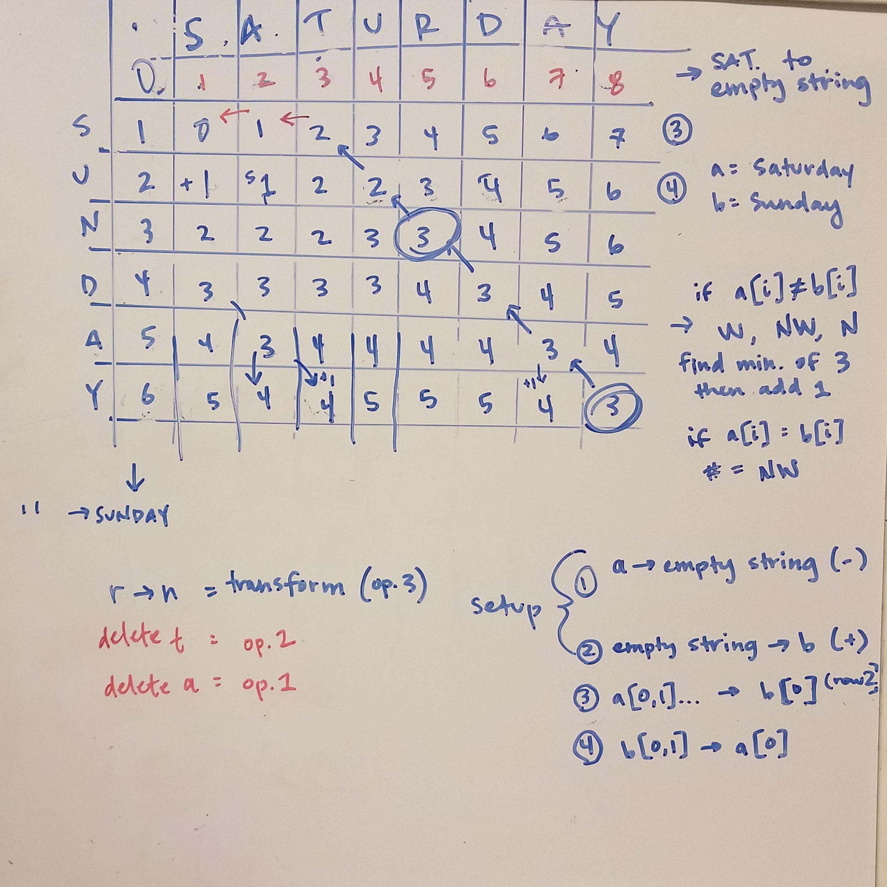

# Levenshtein Distance

Also known as edit distance. String metric used for quantifying the difference
between two strings/sequences. In short, it's the minimum number of character
edits (insertion, deletion, substitution) required to change one string to
another.

A drawn out example of converting Saturday to Sunday (would take 3 operations):

This
[YouTube video](https://www.youtube.com/watch?v=We3YDTzNXEk&list=PLLXdhg_r2hKA7DPDsunoDZ-Z769jWn4R8)
was helpful in understanding some parts of the process.

The general structure for calculating the number of the current cell is:
`(i-1:j)` (W/left of current), `(i-1:j-1)` (NW/diagonally top-left of current),
`(i: j-1)` (N/above current).
